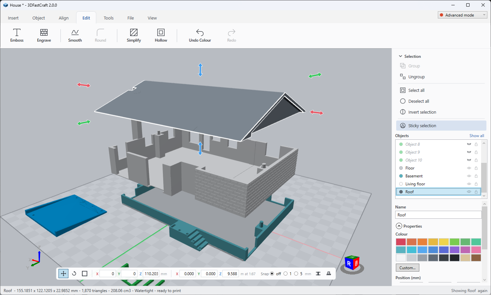

# 3DFastCraft

A small Windows desktop app for building simple printable geometry — a replacement for the
retired Microsoft 3D Builder. Drop in primitive shapes, size them exactly, cut and combine
them, and export a clean `.stl` or `.obj` for slicing.

Everything is in **millimetres**, **Z-up**, on a 200 × 200 mm build plate — the conventions
every slicer expects.



> *In loving memory of Windows 3D Builder. Rest in peace.*

## Requirements

- Windows 10/11, 64-bit
- A GPU supporting Direct3D 11 (feature level 11_0)
- .NET 8 Desktop Runtime — *unless* you use the self-contained build below

## Building and running

Double-click **`build.bat`** to produce a standalone `build\3DFastCraft.exe` (~160 MB) that runs
on any 64-bit Windows PC with no .NET install, then **`run.bat`** to start it. `run.bat` falls
back to running from source if no exe has been built yet.

From a shell instead:

```bash
dotnet run --project src/FastCraft3D
```

```bash
dotnet test
```

> `build.bat` deliberately does not pass `PublishTrimmed`. WPF resolves XAML types reflectively
> and trimming breaks the app at runtime.

## Using it

| Tab | What it does |
|---|---|
| **Insert** | Cube, cylinder, cone, sphere, pyramid, wedge, torus, hexagon, tetrahedron; import STL/OBJ |
| **Object** | Subtract / Intersect / Merge, Smooth, Round edges, Split with a plane, Colour, duplicate (beside or in place), delete, drop to plate, lay on face, mirror |
| **Align** | Line the selection up on X, Y or Z: flush to either edge, centred, or spread evenly |
| **Edit** | Emboss lettering or a drawing, engrave a pattern, repair, rebuild, simplify, hollow, undo, redo |
| **File** | New, open, recent, save, save as, save a version, versions, export STL/OBJ |
| **View** | Zoom to fit, top / front / right / isometric, measure, wireframe, x-ray, build plate size and visibility |

**Camera:** left-drag orbits, right-drag pans, the wheel zooms. Dragging horizontally turns the
scene around the vertical **Z** axis, like a turntable - the plate never rolls onto its side.

**Selection:** a menu on the right of the viewport holds the selection tools, with
**Sticky selection** on by default, as in 3D Builder. Collapse the menu with the chevron.

With sticky selection **on**, clicking an object toggles that object and nothing else: click to
select, click again to deselect - the only way to deselect one - and click a second object to
add it. No modifier key. Clicking empty space orbits the camera and leaves the selection alone.

With it **off**, selection follows File Explorer: a plain click selects one object, **Ctrl+click**
adds or removes one, **Shift+click** takes everything between the last object clicked and this
one in object-list order, and clicking empty space clears the selection.

| Menu entry | What it does |
|---|---|
| **Group** | Combines the selected objects into one. Their meshes are concatenated, not fused, so Ungroup can tell them apart again. For a true boolean union use **Merge** on the Object tab. |
| **Ungroup** | Splits the selection into its separate pieces. Pieces are found geometrically, so this also breaks up an imported STL holding several loose parts. Parts that genuinely touch are one piece and stay together. |
| **Select all** / **Deselect all** | Everything, or nothing. |
| **Invert selection** | Swaps what is and is not selected. |
| **Sticky selection** | The toggle described above. |

Left-drag *on an object* also moves it across the plate; hold **Shift** to constrain to one axis.

Inserting a shape never moves the camera - it lands at the origin, sitting on the plate.

In the position, size and rotation boxes, **Up/Down** and the **mouse wheel** nudge the value by
1 — hold **Shift** for 10 or **Ctrl** for 0.1. A nudge also rounds onto that step, so a value
like 4.37 tidies up rather than carrying its rounding error forever.

Resizing works about the object's centre, so both faces move outward and the dimension grows by
twice the handle's travel. The toggle beside the proportions one - or **O** - holds the face
opposite the handle exactly where it is, so the object grows by precisely what you dragged and
only the way you dragged it. That is what you want when a part has to keep meeting its neighbour.

**Snap** in the manipulator bar constrains drags to whole millimetres or 5 mm.

**Stop on contact** - the toggle beside it, or **C** - stops a dragged object where it meets
another rather than letting it pass through, which is how parts get slid together without typing
coordinates for them. It is measured on the **shapes themselves**, not on the boxes round them,
so a ball brought up to a cone stops touching the slope rather than a base radius short of it, and
a part that has been turned stops where it actually meets rather than where its box does. Two
parts that already overlap are left free to move - they were put that way on purpose, usually on
the way to a boolean. It snaps where the object *lands*, not how far it travels, so two parts
dragged onto the same grid meet exactly.

A drag works its answer out once, on the way down, so none of that measuring happens as the mouse
moves. Something too dense to flatten - an import in the hundreds of thousands of triangles -
falls back to its bounding box rather than stalling the drag.

Shortcuts: `Ctrl+Z` / `Ctrl+Y` undo & redo, `Delete`, `Ctrl+C` / `Ctrl+V` copy & paste,
`Ctrl+A` select all, `Ctrl+D` deselect all, `Ctrl+N/O/S` new/open/save, `Ctrl+I` import,
`Ctrl+E` export, and `M` / `R` / `S` to switch manipulator mode.

### Colour

New shapes are handed a colour in turn from a six-colour cycle, so a scene stays legible without
anyone having to paint anything.

To change one, select the objects and click a swatch in the **Colour** grid on the right - the
whole selection is painted in a single undo step. **Custom...** on the Object tab (or the button
under the grid) opens a picker with a saturation/value square, a hue strip, and hex and RGB
boxes; it opens on the colour the selection already has, so a small adjustment starts from
where you are.

Colour is a property of the object, so it survives duplication, booleans, splitting and
rounding, and it is saved in the project file. It reaches **OBJ** exports as a `.mtl` sidecar.
**STL has no notion of colour** - an STL export carries geometry only, which is what slicers
read anyway.

### Repairing a model

A model that would not print raises a banner over the viewport - *one or more objects are
invalidly defined* - and **Repair** on the Edit tab mends what it can: it welds, drops what is
genuinely nothing, makes neighbouring faces agree which way they face, turns any shell that came
out inside out, and caps the holes. A shell enclosed by another is left facing inward, because
that is a cavity and turning it outward would fill in the hollow.

It repairs the selection, or everything if nothing is selected.

What it will not do is guess. A mesh that overlaps itself cannot be mended by patching it
locally - the tools that manage it voxelise the model and rebuild the surface, which would
flatten every detail this app exists to cut. Faced with damage it cannot understand it hands the
mesh straight back and says so, rather than tearing it further.

### Measuring

**Measure** on the View tab reads the distance between two points. Click one, click another, and
the tape is drawn over the model with the distance on it - along with the gap broken down by
axis, since a single number hides which way it runs. A third click starts a fresh measurement.

**Snap to corners and edges** pulls each click onto the nearest corner or edge midpoint, which is
what makes the reading exact rather than approximately wherever the pointer landed. It is on by
default.

The tape is drawn over the viewport rather than in it, so it is never hidden behind the model -
the whole point is to read it.

### Seeing inside

**Wireframe** draws every triangle edge, which is how you see what an import actually costs and
where a boolean has left a mess. **X-ray** fades everything that is not selected, so a part
buried inside another can be seen and worked on - only the unselected fade, since the point is to
look past them at what is selected.

The **build plate** takes any size from 20 to 2000 mm, with the common beds offered, and can be
hidden altogether. It is rebuilt rather than stretched when the size changes: its squares are
10 mm so the board doubles as a ruler.

### Smoothing

**Smooth...** on the Object tab rounds a shape off, with the result shown on the plate as you set
it. Two settings, because smoothing has two halves that are easy to confuse:

- **Smoothness** is how hard the surface is pulled toward its own average.
- **Detail** is how finely the shape is divided up first. Smoothing can only move the points it
  has, so a cube - which has eight - cannot be rounded at all until it has been divided. Each
  step splits every triangle into four without moving anything, and the box is offered enough
  by default.

**Smooth open edges** lets the rim of an unclosed shape move too. Off by default, so an opening
keeps its proper shape; it makes no difference to a closed model.

Smoothing changes the part's size, so the dialog reports it: corners pull in while flat faces
dome very slightly outward, which is what makes a smoothed cube a pillow rather than a smaller
cube. A 20 mm cube comes back about 20.75 mm across.

### Simplifying

**Simplify...** on the Edit tab cuts the triangle count down while keeping the shape. Edges are
collapsed cheapest first, where the cost of a collapse is how far it moves the surface away from
the planes the original triangles lay in - so it costs almost nothing to collapse an edge in the
middle of a flat panel and a great deal to collapse one across a crease. Flat parts thin out;
features stay.

It is the natural partner to **Rebuild**, which produces a great many triangles by design.

### Hollowing

**Hollow...** on the Edit tab turns a solid into a shell of a chosen wall thickness, which is
how a large print stops costing a spool of filament.

The obvious way to do it - offset the surface inward and subtract it - is the one that does not
work: offsetting a mesh folds itself inside out at any concave corner. This measures instead how
deep inside the material each point sits and keeps only what lies within one wall of the surface.
The outer face and the cavity come out of the same pass, correctly facing.

The cavity is sealed. A resin print needs a drain hole, which a cylinder and **Subtract** will
cut. A part with no room for the wall you asked for is left solid and says so.

### Rebuilding a broken model

When **Repair** declines, **Rebuild...** beside it mends the model a different way. Instead of
working on the triangles, it decides for every point in a grid over the model whether it is
inside, and builds a fresh surface between inside and out. That is watertight by construction, so
it fixes anything - including a model whose surface passes through itself, which is what an
import with lettering dropped onto its body rather than fused to it usually is.

The cost is resolution: detail finer than one voxel is gone, and the triangle count quadruples
every time the detail doubles. The dialog says both before you commit - a 20 mm cube at 160
voxels across is over three hundred thousand triangles.

### The manipulator

Select something and a bar appears at the bottom of the viewport with three modes and the
live values for whichever is active. Colours follow the axis indicator in the corner:
**red is X, green is Y, blue is Z**.

| Mode | Handles | Readout |
|---|---|---|
| **Move** (`M`) | A double arrow on each of the six box faces. Drag one to slide along that axis only. | X / Y / Z in mm |
| **Rotate** (`R`) | A ring per **world** axis. Drag a ring to turn around it - on the second turn as much as the first. One toggle snaps to 15° steps; the other squares the object up with the world without moving it. | Roll / Pitch / Yaw in degrees |
| **Resize** (`S`) | The object's **own** box with corner markers, turned with it, plus the six axis arrows. Resizing works about the centre, so both faces move. The toggle keeps proportions. | X / Y / Z in mm |

Turning and resizing work in different frames on purpose. The rings are world axes, because
turning *about Z* means the world's Z - it is what the plate is square to. The resize arrows are
the object's own, because the size boxes give its own width, height and depth, and the scale
behind them is applied before the turn. Pointing the arrows along the world while the drag
stretched the object along its own was simply wrong as soon as anything was rotated.

**Align to axes** - the second button in Rotate mode - sets the three angles back to zero
*without moving the object*: the turn is folded into the geometry instead. Use it when a part has
been turned into place and you now want to resize it along the plate. Zeroing the angles by hand
is not the same thing - that swings the object back to how it was built.

With **several objects selected** the readouts still fill in: position shows the middle of the
lot, rotation shows what they have in common, and size shows how far the whole selection reaches.
Typing carries the group there, keeping its arrangement.

Every drag is one undo step, however many mouse-move events it took, and a drag that changes
nothing adds no step at all. Typing into the readout boxes works the same way as the side
panel — the value commits when the field loses focus.

A selected object is drawn with a **white outline** along its own edges and lifted slightly in
colour. The outline traces the shape rather than the tessellation — a cube shows twelve edges, a
smooth sphere none — so it reads clearly without turning round objects into wireframe. Very
dense imports (over 200k triangles) skip the outline and use the colour lift alone.

The status bar always shows the selected object's size, triangle count, volume, and whether it
is watertight.

**Split**, **Engrave** and **Emboss** take the object over while they run: the manipulator bar and
its handles stand down, and the tool's own handles have the object to themselves. Starting one
puts the others away, since each means something different by a click on the model. Cancel or
apply, and the manipulator comes back.

### Laying a part on its face

**Lay on face** on the Object tab answers the printing question of which way up to put a part.
Press it, click the face you want on the bed, and the object tips over onto it and settles.

It takes the shortest turn that gets there, so the object looks tipped rather than spun, and it
works on a facet of anything round as well - laying it on the tangent there. One click is the
whole job; there is no panel and no second step.

### Rounding edges

**Round...** on the Object tab rebuilds a **cube** or **cylinder** with rounded edges at a radius
you choose, shown on the plate as you set it, on whichever edge groups you tick:

| | Cube | Cylinder |
|---|---|---|
| **Top** | the four edges around the top face | the top rim |
| **Bottom** | the four edges around the bottom face | the bottom rim |
| **Sides** | the four upright edges | *not available - a cylinder has none* |

Any combination works. The radius ceiling follows the choice: rounding only the upright edges of
a tall thin box is limited by its footprint, not its height, so the maximum updates as you tick.

The shape is built by sweeping a horizontal cross-section down it — a rounded rectangle whose
corner radius gives the upright edges, inset along a quarter-circle near each end to give the
top and bottom ones. One sweep covers all eight combinations, including the awkward cases where
a fillet has to die into a sharp edge, which is exactly where treating the three groups as
separate pieces of geometry would need special cases to stitch them together.

It regenerates the shape from its parameters rather than filleting the mesh. Filleting an
arbitrary mesh means detecting edge loops, rolling a ball along them and re-stitching the
surface - a hard problem that fails worst exactly where a boolean has already left an untidy
edge. Generating the rounded form is exact, fast and always watertight, at the price of only
working while the object is still described by its parameters. So rounding is offered on a cube
and a cylinder, and refused on a boolean result, a split half, or an import - which is the
honest answer rather than something that half-works everywhere.

Because the shape is rebuilt at its current size, its scale resets in the process; resizing it
unevenly afterwards will stretch the rounded edges.

Closing, opening or starting a new model with unsaved changes asks first, and cancelling the
prompt cancels the whole action — including the window close.

### Emboss: lettering and drawings

**Emboss...** on the Edit tab raises words off a face or cuts them into it. Select the object,
press it, click the face, and type: the lettering appears on the face as you set it up, with the
font, height and depth alongside.

Letters are real outlines rather than a bitmap, so an O has a proper hole in it and the result is
a few hundred triangles rather than tens of thousands. **Raised instead of cut** stands the
lettering proud of the face rather than sinking it in.

#### A drawing instead of words

**Drawing...** in the panel stamps the filled shapes of an **SVG** file - a logo, a badge, an
icon - and the panel shows the shape it read so you can see it arrived with its holes intact
before committing to it. **Use text** goes back to typing.

A drawing becomes the same thing typed letters become: an outline and the loops inside it. So
everything else in the panel applies to it unchanged - the size, the depth, the bevel, the wrap,
the handles on the face, and the choice of cut or raised.

Paths, rectangles, circles, ellipses, polygons and polylines are read, with `transform` followed
down the tree and curves and arcs flattened. Two things are not: **text**, which needs the same
fonts to mean anything (turn it into paths in the drawing program first), and `use`/`symbol`
references. A drawing of nothing but unfilled lines has no area and comes back empty.

#### Putting it where you want it

Two handles sit on the lettering itself: a **blue grip** in the middle slides it about, and an
**orange knob** turns it. A dashed box shows what it covers. **Across**, **Up** and **Turn** in
the panel are the same three numbers, so a drag can be tidied up by typing, and every field takes
arrow keys and the wheel.

Clicking the object again re-anchors the lettering to where you clicked; clicking a *different*
face starts fresh.

#### Wrap

| Wrap | What it does |
|---|---|
| **Planar** | Flat on the face, which is what most lettering wants |
| **Cylindrical** | Bent round the object as a barrel - a ring, a cup, a bottle |
| **Spherical** | Laid over it as a ball |

The curved ones are anchored where you clicked rather than at the object's middle, so a barrel
picked on its side is lettered through that exact point. Across is measured as **arc length**, so
letters keep their proportions whatever the radius, and a word long enough to go right round
meets itself instead of piling up.

Wrapped lettering is broken up finely enough to follow the curve - but only where it actually
strays from it. Nothing bends along a barrel's axis, so a step straight up one is left alone
however long it is. That is the difference between a couple of thousand triangles and a hundred
and fifty thousand.

#### Bevel

**Bevel** draws the far end of the lettering in, sloping its walls. It is worth having for
printing rather than for looks: upright walls leave raised lettering a step for the first layer
to bridge, and cut lettering a slot exactly one nozzle wide. A bevel wider than the stroke would
swallow it, so a stroke too thin to slope keeps its upright walls rather than closing up.

For an FDM print, the same limits apply as to engraving: **0.4 mm deep** is two layers, and
strokes thinner than a couple of nozzle widths will not slice. Bold at 8 mm or more is a safe
starting point.

### Engraving a pattern

**Engrave...** on the Edit tab puts a repeating pattern on one flat face - brickwork on a
wall, boards on a shed, lap siding on a gable.

Select the object, press **Engrave...**, then **click the face** you want. It highlights in
blue, and the panel on the right fills in with the face's size and how many grooves the current
settings would cut. Click a different face at any time to move the pattern; **Cancel** leaves
the mode.

| Pattern | What you get | Size means |
|---|---|---|
| **Brick** | Running-bond masonry: level courses with the perpend joints staggered half a brick | Brick length; the height follows at a third of it |
| **Wood** | Flowing grain that parts around knots, with a ring or two marking each one | The spacing between grain lines |
| **Stripes** | Evenly spaced parallel grooves - lap siding, panelling, ribs | The gap from one groove to the next |

**Line width** is how wide the cut lines are and **Depth** how far they go in. Stripes and wood
can run either way across the face; brick courses are always level, so it has no direction of
its own.

The pattern is drawn **on the face as you set it up**, from the same code that builds the cutter,
so what you see is what gets taken away. Every field takes **arrow keys and the mouse wheel** as
well as typing - Shift for 10 mm steps, Ctrl for 0.1 mm.

#### Making a corner meet

Two walls will not line up by themselves. Each face measures its pattern from its own bottom-left
corner, and which corner that is depends on which way the face points, so the courses on adjacent
walls start at different places and the joints miss each other where they meet.

**Shift across** and **Shift along** slide the pattern over the face to fix it, and the **blue
grip** on the face is the same two numbers under the pointer. Engrave the first wall, then on the
second drag the grip - or nudge the fields with the arrow keys - until the preview's joints line
up with the wall you have already cut. Shifting by a whole repeat changes nothing, so there is
only ever a fraction of a brick to find.

A face picks up its own orientation, so **U runs horizontally on any upright face**: courses come
out level on a wall whichever way the wall faces, without you having to line anything up.

#### Depth, and what will actually print

The panel warns when the settings will not survive the printer, because the numbers that look
reasonable often do not:

- **Under 0.4 mm deep** is less than two 0.2 mm layers, and an FDM slicer will simply drop it.
  0.1 mm is fine on resin and invisible on FDM.
- **Lines under 0.8 mm wide** are narrower than two passes of a 0.4 mm nozzle, and go the same
  way.
- **Deeper than the wall** is called out with the thickness actually available behind the face,
  as is anything taking more than half of it.

Since nozzles and filaments differ, the depth is yours to set - the panel only tells you what
the number means. For most FDM work **0.5-0.8 mm deep with 1-1.5 mm lines** reads well and
prints without any support: the overhang at the top of a groove is only as wide as the groove is
deep, which every printer bridges.

Wood is built differently from the other two. Brick and stripes are rectangles; grain is a set
of curves. The curves are generated freely and then walked in order with a minimum gap enforced
between neighbours, because two of them crossing has no sensible answer. Where the gap bites, the
grain flattens slightly - it can never fold.

#### Raised instead of cut

**Raised instead of cut** stands the pattern off the face rather than sinking it in: bricks with
mortar between them, boards with a gap, grain standing proud like the hard rings of a weathered
plank. It prints better than a cut pattern - the nozzle lays a raised line down where it has to
miss a groove of the same size - and it is the mode to reach for on anything with four walls.

A raised pattern on a plain flat face is not a boolean at all. The face's own triangles are
thrown away and laid again around the pattern: a frame joining the pattern to the face's real
outline, the pattern itself at two levels, and a wall where the two meet. Every vertex on the
outline is one the model already had, so nothing else in the object is touched. The result is
watertight by construction rather than by repair - and, because nothing accumulates, the fourth
wall of a box is no harder than the first. It used to be impossible.

Cutting still goes through the boolean, because a cut groove is allowed to run off the edge of
its face and a raised one is not.

A pattern cut with the boolean leaves the object plain geometry - as after a Merge, it can no
longer be rounded.

### Versions

Undo keeps every step with no limit, but only while the app is open. To come back to a model
after closing it, **Save a version** keeps a named snapshot *inside* the `.3dfc` file, and
**Versions...** lists them and restores one. Restoring is a normal undo step, so `Ctrl+Z` brings
the current model straight back.

Versions are deliberately named snapshots rather than a persisted undo stack. Undo steps are
fine-grained — every drag is one — so storing them would mean hundreds of near-identical scenes,
and none of them would tell you which was the one worth returning to. A handful of named
versions is smaller and far easier to navigate.

An ordinary save never discards them, and saves are written to a temporary file and moved into
place, so an interrupted save cannot destroy the scene and its whole history together.

### Splitting

Select one or more objects and press **Split** on the Object tab. The plane appears with its own handles:
the blue arrows slide it along its normal, and the coloured rings tilt it — so the plane is not
limited to the three axis-aligned orientations. Then choose which side to keep; the buttons are
named after the direction the plane actually faces, so a horizontal plane offers **Top** and
**Bottom** rather than an abstract front and back. Both halves come out capped and closed.

The plane belongs to the scene rather than to an object, so it cuts **everything selected** in
one stroke and one undo step - which is how an assembly gets sliced in half. Its travel and its
handles are sized to the whole selection, and objects the plane misses are left alone rather than
being dropped.

### Making a hole

Insert a cube. Insert a cylinder, set its size to 10 × 10 × 40 mm so it passes right through.
Select both (`Ctrl+A`) and press **Subtract**. The status bar should read
*"Watertight — ready to print"*.

Boolean order follows the object list: the first selected object is the one the others are cut
out of.

## Formats

| Format | Notes |
|---|---|
| `.stl` (binary, default) | Smallest and fastest. Objects merge into one triangle soup — STL has no notion of separate parts. |
| `.stl` (ASCII) | Human-readable, roughly five times larger. |
| `.obj` | Keeps objects named and separate, and writes a `.mtl` sidecar with colours. |
| `.3dfc` | The project format: GZip-compressed JSON that keeps objects and transforms editable. |

**Export** opens an options dialog before the file dialog:

- **What to export** — everything on the plate (the default) or just the selection. Scope is
  asked for rather than inferred from what happens to be selected, because a model that quietly
  lost half its parts is only discovered in the slicer.
- **Format** — binary STL, ASCII STL or OBJ.
- **Drop to the build plate** — moves the whole export together so its lowest point rests on
  Z = 0, keeping the parts in their relative positions.

The dialog reports the triangle count, volume, bounding size and whether the result is
watertight before anything is written. Exporting warns — but does not block — if it is not.

## How it works

The modelling core (`Geometry`, `Model`, `Io`) contains no renderer types at all; only
`Render/` knows about Direct3D. That separation is what keeps the viewport swappable.

**Boolean operations** use a hand-written BSP-tree CSG engine (`Geometry/Csg/`). No maintained
CSG library exists on NuGet, and the same engine backs three features: the boolean menu, the
plane split — expressed as a boolean against an oversized half-space box, so the cut faces come
out capped automatically — and the guarantee that results stay closed.

A few decisions worth knowing about if you touch this code:

- **CSG runs in double precision.** Float32 leaves ~1.5e-5 mm of noise at build-plate
  coordinates, enough to misclassify a vertex against a cutting plane and leak the solid.
- **CSG runs on a dedicated 256 MB-stack thread** (`CsgRunner`). BSP building recurses per tree
  level; a few tens of thousands of triangles overflows the default 1 MB stack.
- **Splitting is parallelised** across cores above 512 polygons, with per-chunk buckets merged
  in order so output is identical to the serial path — a unit test enforces this. Reproducible
  results matter: polygon order determines the shape of the BSP tree.
- **Results are repaired** (`MeshRepair`). BSP CSG leaves T-junctions and occasional
  zero-thickness "fins"; both read as non-manifold. The two repairs iterate together, because
  closing a T-junction re-welds and can create fins.
- **Welding searches a 27-cell neighbourhood.** Merging only exact grid-key matches silently
  fails for vertices that straddle a cell boundary, leaving zero-length edges.
- **Mirroring flips triangle winding.** A negative-determinant transform reverses handedness;
  without the flip the STL exports inside-out. Handled once, in `MeshTransform.Transformed`.

**Two separate settings have to agree that Z is up.** The camera's `UpDirection` only decides
how the picture is oriented; the turntable orbits around the viewport's `ModelUpDirection`,
which defaults to Y. Left at the default, a horizontal drag orbited around the green axis and
the scene could roll onto its side. The view cube reads the same property. It is set to
`(0,0,1)` in `ConfigureCameraGestures`.

**The object list does not bind `ListBoxItem.IsSelected`.** That looks like the natural way to
mirror `SceneObject.IsSelected`, and it is quietly wrong: a ListBox generates item containers on
a later layout pass, and a fresh container starts out unselected because the Selector does not
know about it yet. A two-way binding pushes that initial `false` back into the model, undoing a
selection made in code — a newly inserted shape never looks selected, and a click in the 3D view
is reverted on mouse-up. `View/SelectionListSync` copies the two sides explicitly instead, one
direction at a time behind a re-entrancy flag, with the scene as the single source of truth.

**The manipulator handles are 2D, not 3D.** `GizmoController` draws them on a canvas over the
viewport, positioning each by projecting a point of the selection's bounding box to screen
space. A 3D arrow shrinks to nothing when you zoom away from a 5 mm part; a projected one stays
a constant, clickable size, picking becomes ordinary WPF hit-testing, and every drag reduces to
2D vector maths. The canvas has no background, so a click that misses a handle falls straight
through to the camera. Two consequences worth knowing:

- The controller depends on `IScreenProjector`, not on the viewport. That is what lets the
  handle layout and all three drag behaviours be tested against a stand-in camera with no GPU —
  WPF shapes expose nothing to accessibility tools, so there is no other way to check them
  automatically.
- Geometry is always built with its top-left at the origin and then placed with `Canvas.Left`.
  A WPF `Path` offsets its geometry to the bounding-box origin during layout, so handing it
  absolute screen coordinates would apply that shift twice.
- The per-frame update asks whether the handles are still where the *current projection* puts
  them, rather than watching the camera and window size that feed it. A resize changes the
  answer without touching either, and the viewport may still be reporting the old answer at the
  moment the resize is signalled — so an input-based check laid out from stale coordinates and
  then never noticed. Watching the output makes any discrepancy self-correct on the next frame.
- A layout is only applied when the projection is usable at all. A viewport that cannot project
  collapses every point onto one spot, so a solid with real size becomes a dot. The handles hide
  instead, and `NeedsReposition` forces a retry.
- `SceneObject.WorldBounds` is cached, because that per-frame check reads it and computing it
  means transforming every vertex.

**Lettering never learns about the shape it is going onto.** Outlines are laid out flat, in
millimetres, and a separate `IPlacementSurface` says where a flat point ends up in space. That is
what lets the same letters go onto a face, round a barrel or over a ball without the glyph code
knowing which, and it is what lets the placement handles serve the engraving tool as well — the
gizmo asks the surface where a layout point lands and how far a millimetre of layout carries on
screen, and nothing in it knows whether it is placing a word or a brick course.

The surface also answers **how far a straight step strays from it**, which is what decides where
the lettering gets broken up. Measuring the step's *length* instead is the obvious thing and is
wrong: nothing bends along a barrel's axis, so a long step that way is already perfect while a
short one round the barrel is not. Splitting by length quadrupled the whole solid to fix a
handful of edges — 147,456 triangles and 24.8 seconds for one short word, with thousands of torn
edges in the result. Splitting only what strays gives 1,168 triangles and 124 ms.

**A boolean leaves T-junctions, and no amount of repairing will mend them.** Where it splits one
polygon it need not split the one beside it in the same place, so a long edge on one side ends up
facing two shorter ones with a vertex partway along it. The surface is closed to look at and
prints perfectly; it is not closed as a list of triangles. Repair could see nothing wrong -
there is no hole and nothing is inside out - so a fifth of all rounded-box booleans came back
reported as broken and could not be fixed. `MeshStitch` splits those edges so both sides share
their corners, which cannot change the shape: the corners were on the edge already.

Two attempts that did not work are recorded where they were made. Splitting one edge per triangle
per pass never settles, because the two triangles either side of an edge each split whichever of
their own edges came first. And sizing the vertex grid by the cube root of the count leaves
scores of vertices in every cell, since a mesh's vertices sit on a surface rather than filling
the space - 139 seconds on an 84k mesh, against 569 ms once it was square-rooted.

**GPU use is confined to rendering.** Direct3D 11 via `HelixToolkit.SharpDX.Core.Wpf` gives
MSAA and handles imported meshes of millions of triangles. Booleans stay on the CPU
deliberately: BSP tree work is serial and branch-heavy, and GPU voxel/SDF booleans — robust as
they are — produce resolution-limited, stair-stepped output, which is the wrong trade for clean
primitives headed to a slicer.

## Known limits

- Boolean operations on imported meshes above ~200k triangles are slow (the app warns on
  import). The GPU renders them fine; the BSP tree is the bottleneck.
- `SharpDX` 4.2.0 is unmaintained upstream. It works on Windows 11 and is fully managed, but it
  is the one long-term liability — the renderer-agnostic core is the insurance.
- Engraving covers the face's **rectangular extent**. On anything convex the overshoot
  hangs in mid-air and cuts nothing, so a gable end or a round cap comes out right, but a
  separate face lying in the same plane and inside that rectangle is engraved too, and an
  inside corner loses half a millimetre off the neighbouring face.
- **A fine pattern cut into a face that has been cut about already** can refuse to go on. Every
  earlier pattern left a notch wherever a groove met an edge, and the new one has to be cut
  around them; where two faces meet exactly rather than crossing, the boolean tears. It is
  retried from a slightly different pattern first - the status bar says when that happened -
  but it does not always get through. A coarser pattern, a shallower depth, or nudging
  **Shift across** by a tenth of a millimetre usually does. **Raised instead of cut** does not
  have this problem at all, since it never touches the boolean.
- **A drawing whose shapes overlap each other** is stamped the slow way, and may not go on.
  Which loops are holes is decided by asking whether one lies inside another, and for outlines
  that cross, that question has no answer - so it falls back to the boolean, which builds each
  shape separately and puts the walls of one inside the other. Merge overlapping shapes in the
  drawing program first.
- **Letters with an enclosed middle - O, B, A, D - wrapped round a barrel** are past what the
  boolean will do: the cutter is sound but the result comes back torn. It is refused rather than
  shipped, so the object is left as it was. Lettering without counters wraps fine, and **Rebuild**
  on the Edit tab remakes a shape the boolean has given up on.
- Engraving and lettering are refused outright rather than applied badly whenever the result
  would not be watertight. The object is never left in a worse state than it started.
- No 3MF, and no printer integration.

## Layout

```
src/FastCraft3D/
  Geometry/   meshes, primitives, transforms, repair, plane split, Csg/ (the BSP engine),
              Engraving/ (patterns, lettering, the surfaces they are laid on)
  Text/       the one place that asks the operating system about fonts
  Model/      scene objects, scene, Commands/ (undo-redo)
  Io/         STL, OBJ, SVG outlines, .3dfc project files, export composition
  Render/     the only Direct3D-aware layer, plus the on-screen manipulator
  View/       selection mirroring between the object list and the scene
  ViewModels/ commands and application state
tests/FastCraft3D.Tests/   geometry, CSG, IO, workflow and manipulator cover
```
