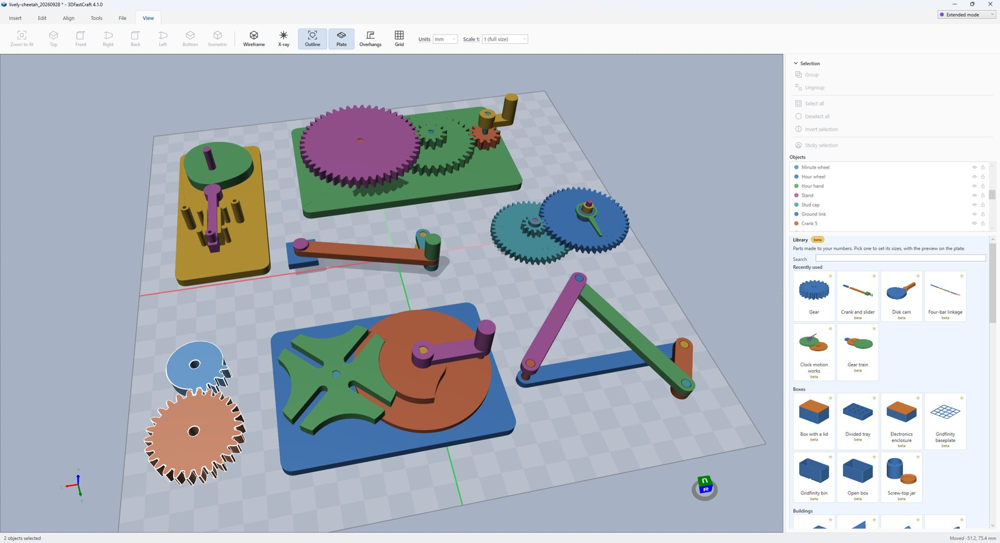

# 3DFastCraft

A lightweight Windows app for 3D printing: shapes at exact sizes, cut and combine, a library of
parts made to your numbers, watertight STL and 3MF.

**Website: [3dfastcraft.com](https://3dfastcraft.com/)** · [Download the latest release](https://github.com/Sorbiers/3DFastCraft/releases/latest)

> **In active testing.** Tools marked **beta** are new and still being proved in real prints -
> check what they give you before a long print. Releases come often.



## The idea

It began as a replacement for **Microsoft 3D Builder**, which Microsoft retired: the same short
path from a shape on the plate to a printable part, with almost nothing to learn first. It then
grew well past it - a parts library, working mechanisms, molds, patterns, lithophanes.

The **Classic** view shows the tools 3D Builder had, for anyone who wants the old app back.
**Advanced** (the default) adds the working set; **Extended** adds the specialized and
experimental tools. Only buttons are hidden - every key works at every level.

Almost all of it is written by [Claude Code](https://claude.com/claude-code) from prompts.

## Features

### Insert

- **Shapes** - cube, cylinder, cone, sphere, pyramid, wedge, torus, hexagon, tetrahedron, landing
  on the plate at a sensible size.
- **Custom shape** - a primitive with its segments and roundness chosen before it is made.
- **Text** - lettering as an object: flat, round a circle or round a cylinder, any installed font.
- **Sketch** - lines, arcs, curves, freehand or an SVG on the plate, extruded or revolved.
- **Import** - STL, OBJ, 3MF, SVG as a solid; another `.3dfc` project *joins* the plate.
- **Library** (Ctrl+L) - parts made to your numbers, previewed as you type, remade later with
  **Edit settings**: boxes and Gridfinity, organizers, hinges, clips, threads, washers, knobs,
  gears and mechanisms, stairs, windows, doors, roofs with dormers, lithophanes and lamps,
  calibration prints.
  - **Working model** - any mechanism as a set to print and turn by hand: base, D-shafts,
    crank or handwheel, guides that print without supports. **Turn it** plays the motion first
    and stops at a jam.
  - **Lay out for printing** - on: every part side by side, each its own object and color.
    Off: put down assembled, as one group (**Ungroup** takes it apart).
  - **Resizing the preview** on the plate - the size boxes or the handles - changes the part's
    own size settings and remakes it rather than stretching it: a roof made longer keeps its tiles.
- **Lithophane** - a photo as a plate lit from behind; flat, curved, or a lamp of 3-12 sides on
  an E26/E27 socket base.

### Edit

- **Undo, copy, paste** - paste lands where the copy came from, also between two app windows.
- **Duplicate** - beside, or in place.
- **Subtract / Intersect / Merge** (Ctrl+- / Ctrl+=) - with **Subtract**, the cutter is the last
  one picked; a **tolerance** takes it out that much wider, so printed parts fit.
- **Split** - with a plane you drag or type; keep either half or both.
- **Set pivot** - turn and measure about a point you click (a shaft hole, a hinge line).
- **Round edges**, **Twist / Taper / Bend**, **Simplify**, **Smooth**, **Hollow**.
- **Fill up** - fills what the part would hold if liquid were poured in from above, to a level:
  the inside of a cup or a box, a recess, a sealed hollow; a pocket open to the side fills only up
  to its opening, and with *The plate is a floor* a tube or walls standing on the plate fill too.
  Solid, or as a part of its own that fits the inside exactly (a second filament, or a cavity's volume).
- **Color and filament** - per object; 3MF carries both.

### Align

- **Drop to plate** - sets the selection on Z = 0.
- **Drop down** (End) - moves the selection straight down until it rests on whatever is under it,
  or on the plate. It goes by the shapes, not their boxes, so crossed ridges stop where they
  meet. With **Ctrl** or **Shift** (or **Ctrl+End**) it sinks 0.2 mm into the part below, so
  **Merge** joins them as one solid instead of two touching faces.
- **Place on face** / **Best face down** - tip a part onto a face you click, or pick from every
  way up ranked for printing.
- **Align to face** - click a face on *any* object; then for X, Y and Z choose a place on that
  face (near edge, middle, far edge) and the point of the selection that goes there. Near to
  near sits it flush; near to far stands it beside. Red marks the place, blue the point.
- **Center face to face** - click a face on the selection, then one on another object: their
  middles meet on the axes you tick. Click the **side of a pin** or the **wall of a hole** and
  the round surface is taken whole, by its axis - Apply puts the pin on the hole's axis
  (turning it parallel first, if asked) and the panel reads both diameters and the gap.
- **Align, Distribute, Fit, Mirror** - line up on X, Y or Z, spread evenly, fit to the plate.

### Tools

- **Mold** - a silicone mold that comes apart: split at the widest section, keyed, with pour
  hole and vents.
- **Repair / Rebuild** - mend an open mesh, or remake the surface from scratch.
- **Convex hull** - wrap parts in one skin (two cylinders into a slot).
- **Voronoi** - cut a part into a web of struts; watertight by construction.
- **Extrude down** - a flat base under a scan, a relief or a tilted part.
- **Split with connectors** - halves that go back together one way: pins, pegs or brick studs.
- **Connect objects** - pins or pegs through the face two resting parts share.
- **Hole** - plain, countersunk or counterbored, nut pocket, heat-set insert; one, a row or a bolt
  circle. With several parts selected it drills them all, lined up; *All the way through*
  goes through the whole stack.
- **Keyhole** - slots to hang a part on a wall, with printed studs and a drilling template.
- **Emboss** - lettering, an SVG or a picture (PNG, JPEG) raised or cut into a face, flat or
  wrapped, or a texture over it. On the face: the circle moves it freely, the **arrows** across or
  up only, the knob turns it (15 degree steps; **Alt** turns freely, or type **Turn**), and the
  **corner squares** resize it along the surface - a texture's corners resize the *area* it covers,
  so a corner brick can meet the corner of the face. Raised work keeps off windows and doorways
  already cut in the face. **Keep as its own part** prints it in a second filament.
- **Engrave** - brick, tile, plank, grain and more, cut or raised, laid *around* openings.
- **Repeat** - along a line, round a circle (with a rise, for spiral stairs) or in a grid.
- **Measure**, **Fit check**, **Surface info** - distances, overlap or gap between parts, and a
  face's middle, direction, size and area.

### File

- **Settings** - printer profiles, one per printer and filament: nozzle, layer, and the fits the
  tools start from - sliding clearance (lids, hinges), hole clearance (Hole), press fit (the pins of
  Split and Connect), brick fit and thread clearance. **Printer profile test** in the Library prints
  every fit at once, a few samples either side of the profile's number or up from nought.
- **Projects** (`.3dfc`) with **versions** kept inside the file; restore is an undo step.
- **Export** STL (binary or ASCII), OBJ or 3MF - everything or just the selection; reports
  triangles, volume and whether it is watertight before writing.
- **Blueprint** (Ctrl+P) - front, top, side and isometric views with dimensions and a title
  block; print, PDF or PNG, plus a parts list.
- **Export session / Record** - every undo step as a file, or a screenshot after every action.

### View

- Axis views, **Wireframe**, **X-ray** (X), **Outline**, **Overhangs** (faces that will need
  support), **Grid**.
- **Units** - mm, cm, m, in or ft; every box and tool panel reads in them. Models are always
  stored and exported in millimeters.
- **Model scale** - set 1:87 and a second set of boxes reads real size beside the model's.

## Working with it

- **Selection** - *Sticky* (default, as 3D Builder): a click toggles one object. Off: Explorer
  rules - Ctrl+click adds, Shift+click takes a range, clicking empty space clears.
- **Handles** - **M** move, **R** rotate, **S** resize; **Snap** to 1 or 5 mm. **O** resizes one
  way only, the opposite face staying put. The resize strip reads mm or %; the box corners,
  dragged, resize in proportion.
- **Stop on contact** (**C**) - a dragged part stops where its *shape* meets another, not its
  box. Parts that already overlap move freely.
- **Number boxes** - every one, in every panel - take `+=5`, `-=5`, `*=1.5`, `/=2`; the wheel and
  arrows nudge (Shift ×10, Ctrl ×0.1), and a count stays whole.
- **A tool in hand has the plate to itself** - only the selection is drawn until it is put down;
  **X-ray** shows the rest. Tools that pick a face on anything (align to face, center face to
  face, surface info, measure) keep everything.
- **Enter** applies the tool in hand, **Esc** puts it down, **Ctrl+Space** runs the last tool
  again. **H** / **L** hide or lock the selection. **F1** lists every key.

## Formats

| Format | |
|---|---|
| `.stl` | Binary (default) or ASCII. One triangle soup - no separate parts. |
| `.obj` | Named, separate objects, colors in a `.mtl` sidecar. |
| `.3mf` | Parts, names, colors, units and filaments in one file, with a thumbnail. |
| `.3dfc` | The project: GZip JSON, everything editable, versions inside. |

## Requirements

- Windows 10/11, 64-bit.
- **Direct3D 11** graphics (feature level 11_0) - any integrated GPU since about 2010. Without it
  the app says so and stops: a VM without a display driver, some remote desktops, or a fresh
  Windows still on the Basic Display Adapter.

## Building

```bash
build.bat
```

A self-contained `build\3DFastCraft.exe` (~190 MB), no .NET needed. `run.bat` starts it, or runs
from source if nothing is built. From a shell:

```bash
dotnet run --project src/FastCraft3D
```

```bash
dotnet test
```

Needs the .NET 8 SDK. `PublishTrimmed` is deliberately off: WPF resolves XAML types by
reflection, and trimming breaks the app at runtime.

## How it works

- **Layers.** `FastCraft3D.Geometry` and the app's `Model/` and `Io/` know nothing of the
  renderer; only `Render/` touches Direct3D (HelixToolkit.SharpDX). Generators live in their own
  project and reach the app only through a small contract.
- **Booleans** go to [Manifold](https://github.com/elalish/manifold) first and fall back to a
  BSP engine (`Csg/`) when it will not load or a solid is not closed. The BSP runs in double
  precision on a 256 MB-stack thread, in parallel above 512 polygons with output identical to
  the serial path. Its results are repaired and **T-junctions stitched**, or a closed surface
  reads as broken.
- **Watertight or refused.** Anything built on a boolean checks the result and refuses rather than
  ship a broken model. Aggressive healing was tried and made things worse.
- **Split by a plane** does not use the boolean: `PlaneClip` cuts the triangles and fills the
  opening - 214k triangles in 1/25 s, where the boolean took 20 s and tore.
- **Lettering is laid out flat**; an `IPlacementSurface` says where a flat point lands - a face,
  a barrel, a ball - and only steps that stray from the surface are split.
- **Handles are 2D**, drawn on a canvas by projecting the selection's box, so they stay
  clickable at any zoom and are testable without a GPU (`IScreenProjector`).
- **Z is up** in two places that must agree: the camera and the viewport's `ModelUpDirection`.
- **The object list** does not bind `ListBoxItem.IsSelected`: fresh containers would push
  `false` back and undo selections made in code. `SelectionListSync` mirrors it by hand.
- **Mirroring flips winding** once, in `MeshTransform.Transformed`, or exports come out inside
  out.

## Known limits

- Booleans on imports above ~200k triangles can be slow; **Abort** stops one and leaves the
  model as it was.
- Patterns and wrapped lettering with counters (O, B, A) can be refused on a face already cut
  about or on a barrel - refused, never left torn. **Raised instead of cut** avoids the boolean.
- A face with a round hole cannot take a pattern; pattern before merging a boss onto it.
- A set put down assembled is grouped but not one solid - lay it out to print it.
- Undo keeps about a gigabyte of history; the oldest steps go beyond that, with an offer to
  save a version.
- SharpDX 4.2 is unmaintained upstream - the renderer-agnostic core is the insurance.

## Layout

```
src/FastCraft3D.Geometry/     meshes, primitives, transforms, repair, CSG, plane split, gears,
                              threads, Engraving/, Sketches/, Drawings/, Moulding/
src/FastCraft3D.Generators/   the Library: contract, generators, their panel, motion
src/FastCraft3D/
  Model/      scene, objects, bed placement, Commands/ (undo)
  Io/         STL, OBJ, 3MF, SVG, pictures, .3dfc, recovery, settings
  Render/     the only Direct3D layer, and the on-screen handles
  View/       tool panels, dialogs, keys, object list
  ViewModels/ commands and state
tests/FastCraft3D.Tests/      geometry, CSG, IO, generators, tool flows, handles
tools/                        checking exports by measurement; tools/ui drives the running app
```

## Licence

**BSD 3-Clause with the Commons Clause** - use, change and pass it on freely, in a business too;
selling the software itself needs a commercial licence, so ask. Models you make are your own.
See [LICENSE](LICENSE) and [THIRD-PARTY-NOTICES.md](THIRD-PARTY-NOTICES.md).

## Contributing

Bug reports, models that break something, and patches are welcome - see
[CONTRIBUTING.md](CONTRIBUTING.md).
